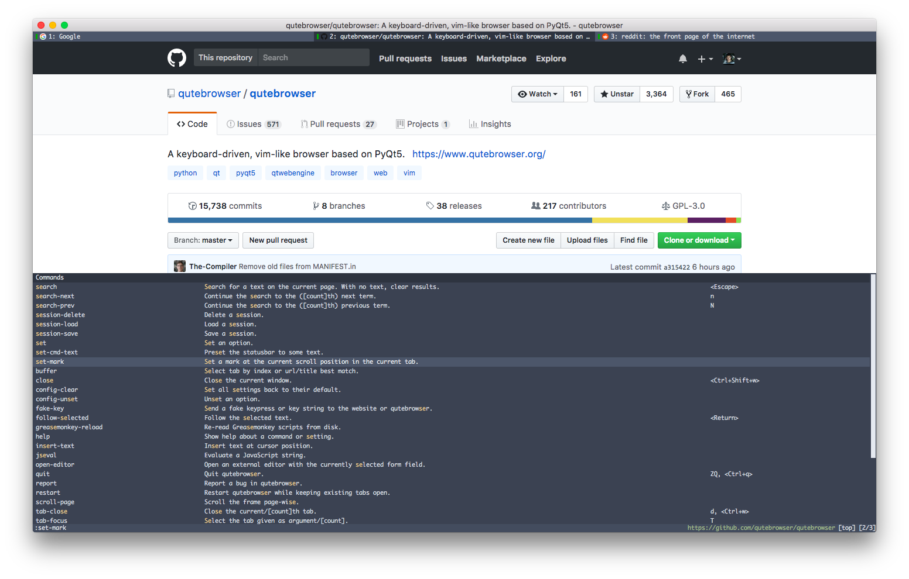

# Nord Qutebrowser Theme

A theme for [Qutebrowser](https://qutebrowser.org) based on the [Nord](https://github.com/arcticicestudio/nord) theme.

## Install

1. Clone this repo or copy `nord-qutebrowser.py`.
2. Add `exec(open('/path/to/nord-qutebrowser.py').read())` at the _end_ of you `config.py` file.
